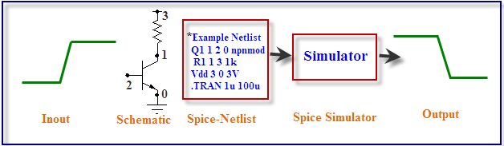

## SPICE

In the experiments we have done till now we have designed gates by arranging transistors in various fashions. The simulation of these designs gave graphs of output voltages and we analyzed how these graph changes with varying different parameters of the transistor. Now when you place a transistor on screen there is a back end code which tells a simulator what are the points to which the transistor's substrate, gate, drain, source are connected. The language in which this information is conveyed is spice.

**INTRODUCTION TO SPICE**

SPICE (Simulation Program with Integrated Circuit Emphasis) is a powerful program that is used in integrated circuit and board-level design to check the integrity of circuit designs and to predict circuit behavior. SPICE was originally developed at the Electronics Research Laboratory of the University of California, Berkeley (1975). Simulating the circuit with SPICE is the industry-standard way to verify circuit operation at the transistor level before committing to manufacturing an integrated circuit. In spice program, circuit elements (transistors, resistors, capacitors, etc) and their connections being translated into a text net list.

Several types of circuit analyses can be done using SPICE program. Here are the most important ones-

 - DC analysis: calculates the DC transfer curve.
 - Transient analysis: calculates the voltage and current as a function of time when a large signal is applied.
 - AC Analysis: calculates the output as a function of frequency. A bode plot is generated.
 - Noise analysis.
 - Sensitivity analysis.
 - Distortion analysis.
 - Fourier analysis: calculates and plots the frequency spectrum.
 - Monte Carlo Analysis

All analyses can be done at different temperatures. The default temperature is 300K.

## D-Flip-Flop

The working of D flip flop is similar to the D latch except that the output of D Flip Flop takes the state of the D input at the moment of a positive edge at the clock pin (or negative edge if the clock input is active low) and delays it by one clock cycle. That's why, it is commonly known as a delay flip flop. The D FlipFlop can be interpreted as a delay line or zero order hold. The advantage of the D flip-flop over the D-type "transparent latch" is that the signal on the D input pin is captured the moment the flip-flop is clocked, and subsequent changes on the D input will be ignored until the next clock event.  

Timing diagram

From the timing diagram it is clear that the output Q changes only at the positive edge.At each positive edge the output Q becomes equal to the input D at that instant and this value of Q is held untill the next positive edge

**Characteristics and applications of D latch and D Flip Flop :**

1. D-latch is a level Triggering device while D Flip Flop is an Edge triggering device.  
2. The disadvantage of the D FF is its circuit size, which is about twice as large as that of a D latch. That's why, delay and power consumption in Flip flop is more as compared to D latch.  
3. Latches are used as temporary buffers whereas flip flops are used as registers.    
4. Flip flop can be considered as a basic memory cell because it stores the value on the data line with the advantage of the output being synchronized to a clock.  
5. Many logic synthesis tool use only D flip flop or D latch.  
6. FPGA contains edge triggered flip flops.  
7. D flip flops are also used in finite state machines.  

**Edge Triggering vs. Level Clocking**

1. When a circuit is edge triggered the output can change only on the rising or falling edge of the clock. But in the case of level-clocked, the output can change when the clock is high (or low).  
2. In edge triggering output can change only at one instant during the lock cycle; with level clocking output can change during an entire half cycle of the clock.  
