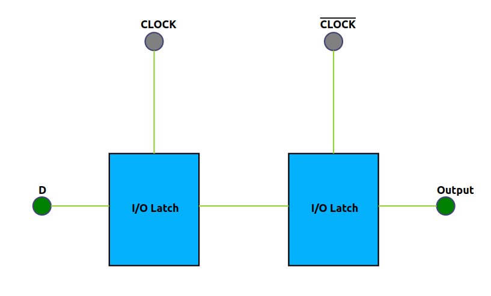

### Schematic Diagram

Below is the schematic diagram for the D-Flip-Flop circuit. The diagram shows the connections for the bulk terminals of both PMOS and NMOS transistors, as well as the sizes (W/L ratios) of the transistors:



- **PMOS:** Connect bulk to VDD
- **NMOS:** Connect bulk to GND

> **Note:** Always ensure the bulk terminals are properly connected: PMOS bulk to VDD, NMOS bulk to GND.

_Transistor sizes: Unless otherwise specified, use Wp = 2\*Wmin and Wn = Wmin for PMOS and NMOS width, and Lmin for length, as declared in the parameter block. This ensures correct sizing for CMOS logic._

### Steps to Perform the Simulation

The simulation page uses colored code blocks to help you visually identify each step in building the SPICE code for a D-Flip-Flop. Each block represents a key part of the code and is color-coded for clarity. Follow the instructions below for a smooth experience:

1. **Arrange the Colored Code Blocks:**

- Start with the blue block for the MOSFET model file (`PTM_45nm.txt`) and parameter declarations.
- Next, use the green block to define the voltage source (`vdd` as positive, `gnd` or `0` as negative).
- The yellow block is for the inverter, pass transistor, 2:1 mux, and D-Latch subcircuit definitions, including input/output names and PMOS/NMOS connections. Use the format:
  ```
  INSTANCE_NAME DRAIN GATE SOURCE BODY MODEL_FILE w=WIDTH l=LENGTH
  ```
- The red block is for instantiating the D-Flip-Flop subcircuit in your main code (using two D-Latches in master-slave configuration).
- The teal block is for declaring the input waveform.
- The purple block is for control statements to run and plot the simulation.
- The gray block marks the end of your SPICE code.

2. **Complete Each Block:**

- Fill in the blanks in each colored block with the required values and names.
- Arrange the blocks in the order listed above for a valid simulation.

3. **Naming Conventions:**

- Start names with an alphabet, `%`, `$`, or `_`.
- Names can include alphanumeric characters, `%`, `$`, and `_`.
- SPICE code is case-insensitive; do not use duplicate names (even with different cases).

### Observations

- After completing and arranging the colored blocks, click "Validate." If everything is correct, you will see a "Success" message, a report, and input/output graphs in the Observations section.
- Use the "Expand Waveform" button to view larger graphs for better analysis.
- Observe how the input signal and output waveform relate to the D-Flip-Flop's operation.

---

**Summary:**  
This improved procedure matches the simulation interface, making it easier for beginners to follow each step and understand the role of every code block. The color coding and clear instructions help ensure a successful SPICE simulation.
