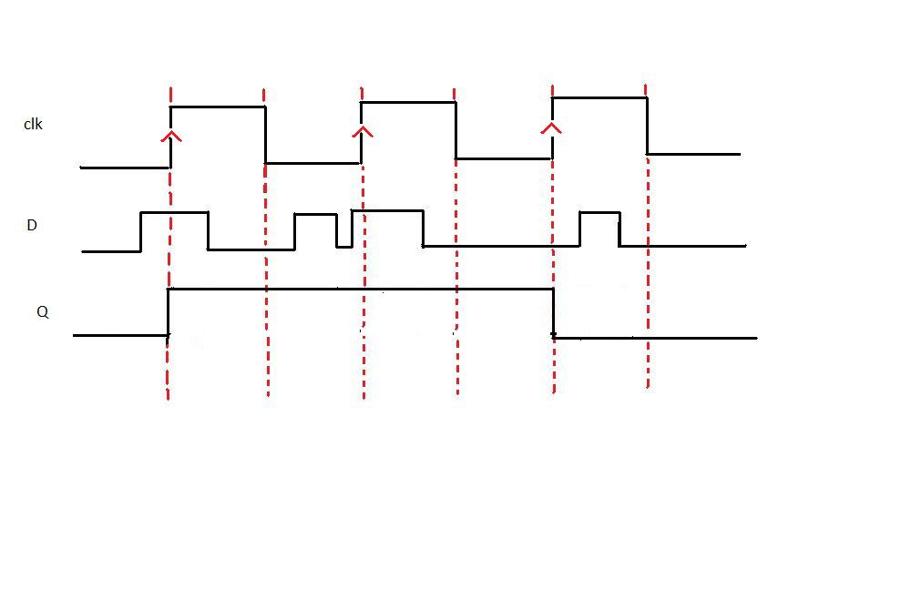
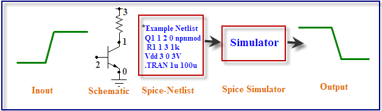
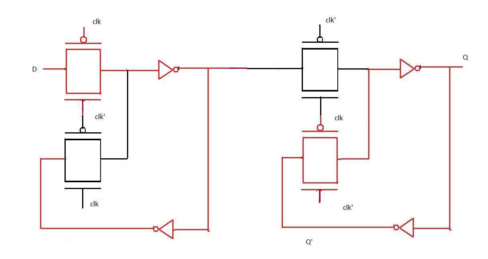
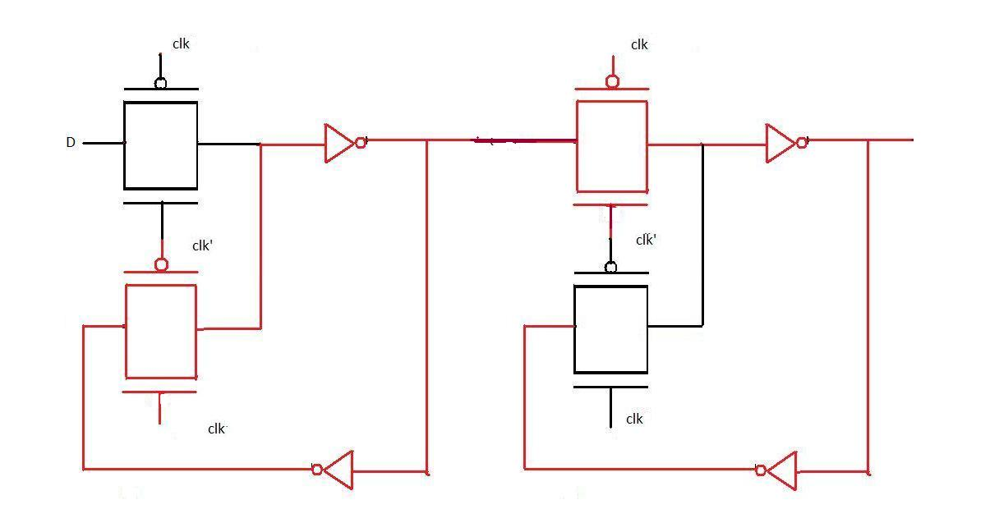

## D-Flip-Flop Fundamentals

The working of D flip flop is similar to the D latch except that the output of D Flip Flop takes the state of the D input at the moment of a positive edge at the clock pin (or negative edge if the clock input is active low) and delays it by one clock cycle. That's why, it is commonly known as a delay flip flop. The D FlipFlop can be interpreted as a delay line or zero order hold. The advantage of the D flip-flop over the D-type "transparent latch" is that the signal on the D input pin is captured the moment the flip-flop is clocked, and subsequent changes on the D input will be ignored until the next clock event.

**Timing diagram:**

From the timing diagram it is clear that the output Q changes only at the positive edge. At each positive edge the output Q becomes equal to the input D at that instant and this value of Q is held until the next positive edge.

**Characteristics and applications of D latch and D Flip Flop:**

1. D-latch is a level triggering device while D Flip Flop is an edge triggering device.
2. The disadvantage of the D FF is its circuit size, which is about twice as large as that of a D latch. That's why, delay and power consumption in Flip flop is more as compared to D latch.
3. Latches are used as temporary buffers whereas flip flops are used as registers.
4. Flip flop can be considered as a basic memory cell because it stores the value on the data line with the advantage of the output being synchronized to a clock.
5. Many logic synthesis tools use only D flip flop or D latch.
6. FPGA contains edge triggered flip flops.
7. D flip flops are also used in finite state machines.

**Edge Triggering vs. Level Clocking:**

1. When a circuit is edge triggered the output can change only on the rising or falling edge of the clock. But in the case of level-clocked, the output can change when the clock is high (or low).
2. In edge triggering output can change only at one instant during the clock cycle; with level clocking output can change during an entire half cycle of the clock.

## SPICE - Introduction and Fundamentals

In the experiments we have done till now we have designed gates by arranging transistors in various fashions. The simulation of these designs gave graphs of output voltages and we analyzed how these graph changes with varying different parameters of the transistor. Now when you place a transistor on screen there is a back end code which tells a simulator what are the points to which the transistor's substrate, gate, drain, source are connected. The language in which this information is conveyed is spice.

**INTRODUCTION TO SPICE**

SPICE (Simulation Program with Integrated Circuit Emphasis) is a powerful program that is used in integrated circuit and board-level design to check the integrity of circuit designs and to predict circuit behavior. SPICE was originally developed at the Electronics Research Laboratory of the University of California, Berkeley (1975). Simulating the circuit with SPICE is the industry-standard way to verify circuit operation at the transistor level before committing to manufacturing an integrated circuit. In spice program, circuit elements (transistors, resistors, capacitors, etc) and their connections being translated into a text net list.

Several types of circuit analyses can be done using SPICE program. Here are the most important ones:

- DC analysis: calculates the DC transfer curve.
- Transient analysis: calculates the voltage and current as a function of time when a large signal is applied.
- AC Analysis: calculates the output as a function of frequency. A bode plot is generated.
- Noise analysis.
- Sensitivity analysis.
- Distortion analysis.
- Fourier analysis: calculates and plots the frequency spectrum.
- Monte Carlo Analysis

All analyses can be done at different temperatures. The default temperature is 300K.

## SPICE Structure and Syntax

A spice input file, also called source file, consists of three parts:

- **Data statements:** These statements are description of the components and their interconnections.

- **Control statements:** These statements are responsible to tell SPICE simulator what type of analysis to perform on the circuit.

- **Output statements:** These statements specify what outputs are to be printed or plotted.

Although these statements may appear in any order, it is recommended that they be given in the above sequence. Two other statements are required: the title statement and the end statement. The title statement is the first line and can contain any information, while the end statement is always .END. The title statement must be a line or word. In addition, you can insert comment statements, which must begin with an asterisk (\*) and are ignored by SPICE Simulator.

**1. Data Statements**

(A) Independent DC Sources

N1 is the positive terminal node. N2 is the negative terminal node. Type can be DC, AC or TRAN, depending on the type of analysis. Value gives the value of the source. The name of a voltage and current source must start with V and I, respectively.

The positive current direction through the current or voltage source is from the positive (N1) node to the negative (N2) node.

(B) Elements: for example MOSFETS

The MOS transistor name (Mname) has to start with a M; ND, NG, NS and NB are the node numbers of the Drain, Gate, Source and Bulk terminals, respectively. ModName is the name of the transistor model (NMOS or PMOS). L and W are the length and width of the gate (in m).

**2. Commands or Control Statements:**

.TRAN Statement

This statement specifies the time interval over which the transient analysis takes place, and the time increments. The format is as follows: TSTEP is the printing increment. TSTOP is the final time TSTART is the starting time (if omitted, TSTART is assumed to be zero) TMAX is the maximum step size. UIC stands for Use Initial Conditions. If UIC is specified then simulator will use the initial conditions specified in the element statements.

**3. Output Statements**

These statements will instruct Simulator what output to generate. If you do not specify an output statement, Simulator will always calculate the DC operating points. The two types of outputs are the prints and plots. A print is a table of data points and a plot is a graphical representation.

The output variables can be voltage or currents in voltage sources. Node voltages and device currents can be specified as magnitude (M), phase (P), real (R) or imaginary (I) parts by adding the suffix to V or I as follows:

- M: Magnitude.
- DB: Magnitude in dB (decibels).
- P: Phase.
- R: Real part.
- I: Imaginary part.

## SPICE Netlist Example - Basic Circuit Elements

**Example SPICE Netlist Components:**

1. **.lib 'models25.txt'**

   - This line includes a library file named 'models25.txt.' The library file typically contains information about models for various components used in the circuit.

2. **mn1 VSS IN OUT VSS nmos l=0.24u w=0.72u**

   - Defines an nmos transistor named 'mn1' with specific characteristics:
     - `mn1`: Instance name.
     - `VSS IN OUT VSS`: Connections for source, gate, drain, and bulk (substrate).
     - `nmos`: Specifies the transistor type.
     - `l=0.24u`: Sets the length to 0.24 microns.
     - `w=0.72u`: Specifies the width of the transistor as 0.72 microns.

3. **mp1 VDD IN OUT VDD pmos l=0.24u w=0.72u**

   - Similar to the previous line but for a pmos transistor:
     - `mp1`: Instance name.
     - `VDD IN OUT VDD`: Connections for source, gate, drain, and bulk.
     - `pmos`: Specifies the transistor type.
     - `l=0.24u`: Sets the length to 0.24 microns.
     - `w=0.72u`: Specifies the width of the transistor as 0.72 microns.

4. **cLoad OUT VSS 50fF**

   - Defines a capacitor named 'cLoad':
     - `OUT VSS`: Connections for one terminal connected to OUT and the other to VSS.
     - `50fF`: Specifies the capacitance of the capacitor as 50 femtofarads.

5. **vVDD VDD 0 2.5**

   - Defines a voltage source named 'vVDD':
     - `VDD 0`: Connections for positive terminal to VDD and negative terminal to the reference node (0 volts).
     - `2.5`: Specifies the voltage value as 2.5 volts.

6. **vVSS VSS 0 0**

   - Defines a voltage source named 'vVSS':
     - `VSS 0`: Connections for positive terminal to VSS and negative terminal to the reference node (0 volts).
     - `0`: Specifies the voltage value as 0 volts.

7. **VIN IN 0 pulse(0 2.5 100ps 100ps 100ps 2ns 4ns)**

   - Defines a pulse voltage source named 'VIN':
     - `IN 0`: Connections for positive terminal to IN and negative terminal to the reference node (0 volts).
     - `pulse(0 2.5 100ps 100ps 100ps 2ns 4ns)`: Specifies the pulse characteristics:
       - `0 2.5`: Pulse amplitude from 0 to 2.5 volts.
       - `100ps`: Rise time.
       - `100ps`: Fall time.
       - `100ps`: Pulse width.
       - `2ns`: Period.
       - `4ns`: Delay.

8. **.dc vIN start=0 stop=2.5 step=0.01**

   - Specifies a DC sweep analysis of the voltage source 'vIN':
     - `start=0`: Starting voltage value.
     - `stop=2.5`: Ending voltage value.
     - `step=0.01`: Voltage step size.

9. **.tran 1ps 8ns**

   - Specifies a transient analysis with:
     - `1ps`: Time step of 1 picosecond.
     - `8ns`: Total simulation time of 8 nanoseconds.

10. **.option post**

    - Sets a post-processing option, which may include additional analysis or data extraction after the simulation. This line directs spice to make an output file

11. **.end**
    - Marks the end of the spice code.

## D-Flip-Flop Implementation using Master-Slave Configuration

**POSITIVE EDGE TRIGGERED FLIP FLOP**

From the introduction it is clear that for a positive edge triggered flip flop the changes in output occur at the transition level. This is done by configuring two D latches in master-slave configuration. A master-slave D flip-flop is created by connecting two gated D latches in series, and inverting the clock input to one of them. It is called master-slave because the second latch in the series only changes in response to a change in the first (master) latch. To understand the transistor level design of positive edge triggered flip flop study the two diagrams below:

**Positive edge triggered flip flop when clock=0:**

As evident from the figure when clk is 0 the input D passes through the first level of pass transistor logic and is held there because the second level does not pass on the value of D.

**Positive edge triggered flip flop when clock=1:**

When the clock input becomes 1, D (at that instant) is transferred to the output. Thereafter output Q does not change when D changes because D is not passed through the first level of pass transistor logic (as seen in the diagram). Now when the clock changes back to 0, Q still remains unaffected by the changes in D because it is now hindered by the second level of pass transistor. Thus we observe that Q remains unchanged for the entire clock cycle and changes only at the positive edge. Hence the above transistor level diagram implements positive edge triggered flip flop.

**APPLICATIONS AND ADVANTAGES OF D-FLIP FLOP**

D flip flop can be considered as a basic memory cell because it stores the value on the data line with the advantage of the output being synchronized to a clock. D flip flops form the basis of shift registers that are used in many electronic devices. Many logic synthesis tools use only D flip flop or D latch. FPGA contains edge triggered flip flops. D flip flops are also used in finite state machines.

**Practice Section Task**

Given the introduction of a positive D-Flip Flop, use that as a reference to build a negative edge D-Flip-Flop in the practice section.
